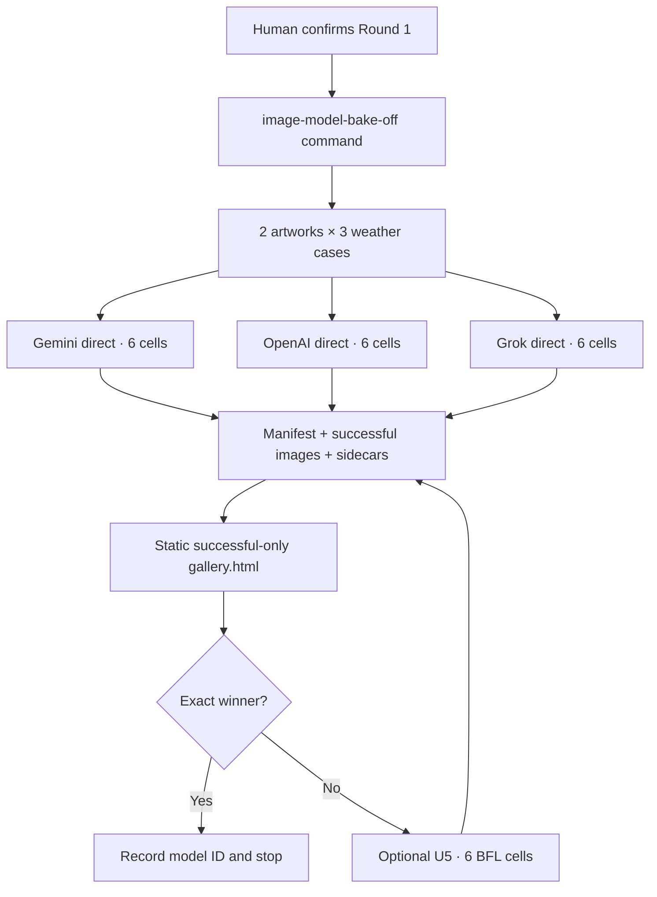

# Temporary Image Model Bake-Off - Plan

## Goal Capsule

- **Objective:** Run three weather transformations on `artwork/hopper.jpg` and `artwork/hotel-adriano.png` with Gemini, OpenAI, and Grok, then open a static gallery containing only successful images. Add Black Forest Labs only if the user records `no_winner` after Round 1.
- **Authority:** The Product Contract and its session-settled decisions override implementation convenience. Every attempt must use the original artwork, keep keys local, and write JSON-safe metadata.
- **Execution profile:** Lightweight, staged, and command-driven. Tests and a fixture gallery make no paid calls. Real image generation occurs only after a human checkpoint.
- **Stop conditions:** Round 1 ends with 18 terminal cells and a recorded exact winner or `no_winner`. A `no_winner` decision may open a six-cell BFL extension. A final `no_winner` retains production Gemini and defers further research.
- **Tail ownership:** The user judges successful images. Production migration remains a separate follow-up.

---

## Product Contract

### Summary

Build one local comparison command, not a temporary Lab feature. Round 1 calls Gemini, OpenAI, and Grok directly with keys the user already owns. It writes a dated manifest, successful images with sidecars, and a static local HTML gallery. BFL remains an optional additive round.

### Problem Frame

Gemini has refused to modify recognized paintings, including the Hopper test image. The user needs a small visual sample, not a benchmark platform. A one-shot command reaches that decision faster than new Express routes, polling, and React state, while keeping billing and secrets local to the provider accounts already in use.

### Key Decisions

- **Use a fixed two-artwork, three-weather bake-off.** (session-settled: user-approved — chosen over a reusable benchmark framework: the user only needs these images and weather cases.) Governs R1-R4.
- **Show successful images and let the user decide.** (session-settled: user-directed — chosen over blind ranking, repeat sampling, and quality scores: the user wants to inspect usable transformations.) Governs R5-R7, R11.
- **Use price-comparable current variants.** (session-settled: user-directed — chosen over older or premium variants: monthly cost must remain near Gemini Flash Lite.) Governs R3-R4.
- **Run Gemini, OpenAI, and Grok first with direct keys.** (session-settled: user-directed — chosen over a four-provider Gateway run: working OpenAI and xAI keys and xAI credit already exist.) Governs R3-R4, R10-R11.
- **Add BFL only after an unsatisfactory Round 1.** (session-settled: user-directed — chosen over funding and implementing BFL immediately: it may be unnecessary.) Governs R3-R4, R11-R12.
- **Keep Gemini in production until migration is verified.** (session-settled: user-approved — chosen over changing the incumbent during the trial: the scheduler and kiosk must remain stable.) Governs R8-R9.

### Requirements

**Inputs and models**

- R1. Every attempt starts from `artwork/hopper.jpg` or `artwork/hotel-adriano.png`. No generated image becomes another attempt's input.
- R2. Every active model receives the same deterministic heavy-rain, heavy-snow, and dense-fog prompts from the existing prompt machinery.
- R3. Round 1 uses direct `gemini-3.1-flash-lite-image`, `gpt-image-2` at low output quality and `1536x1024`, and `grok-imagine-image-2.0` at 1K/low. Conditional Round 2 uses direct `flux-kontext-pro` after its model and price are rechecked.

**Execution and results**

- R4. Round 1 creates exactly 18 terminal cells: 2 artworks × 3 weather cases × 3 models. A ready provider receives one request per cell with SDK retries disabled.
- R5. Each cell ends in exactly one JSON-safe status: `successful`, `unsuccessful`, or `error`.
- R6. `successful` means non-empty returned bytes match a supported image format. `unsuccessful` means an explicit policy/no-image result or unusable bytes. `error` means configuration, authentication, quota, rate-limit, timeout, transport, or another execution failure.
- R7. The generated gallery renders only `successful` images, labelled with artwork, weather, provider, exact model, requested output setting, elapsed time, and a dated price estimate. It shows compact per-model status counts but no failed-image cards or scores.
- R8. Each run writes to `~/.haystack/comparisons/<run-id>/`, separate from production `OutputStore`. Successful images receive JSON sidecars; the manifest records every cell. The command never changes history, purge, scheduler, rotation, or kiosk state.
- R9. Production remains on the current direct Gemini integration throughout this plan.
- R10. Google/Gemini, `OPENAI_API_KEY`, and `XAI_API_KEY` remain process-local and never appear in the manifest, gallery, sidecars, logs, or command output. Round 1 requires no Gateway or BFL credential.

**Human gates**

- R11. The command defaults to a non-generating preflight. After mocked tests and a fixture-gallery review, ce-work pauses for the user before one `--execute round1` invocation. The final Round 1 decision records `winner: <exact model ID>` or `no_winner`.
- R12. Only `no_winner` opens the BFL unit. That unit adds `BFL_API_KEY` and exactly six BFL cells to the existing run without rerunning Round 1, then records the exact winner or final `no_winner`.

### Key Flows

- F1. Round 1
  - **Trigger:** The user approves the fixture gallery and confirms one paid run.
  - **Steps:** The command performs readiness checks, executes 18 fixed cells, writes isolated artifacts, generates `gallery.html`, and prints its path.
  - **Outcome:** The user opens the gallery and records an exact winner or `no_winner`.
  - **Covered by:** R1-R11.
- F2. Optional BFL extension
  - **Trigger:** Round 1 records `no_winner` and the user asks to continue.
  - **Steps:** BFL is added and verified without image generation, then a separate confirmed command appends six BFL cells and regenerates the gallery.
  - **Outcome:** The user records the exact winner or final `no_winner`.
  - **Covered by:** R1-R3, R5-R8, R10, R12.

### Acceptance Examples

- AE1. **Hopper transformed.** Valid Grok bytes for Hopper/heavy rain become a labelled successful image and sidecar.
- AE2. **Hopper refused.** Gemini's explicit refusal or no-image result becomes `unsuccessful` and produces no image card.
- AE3. **Readiness blocks paid work.** A missing OpenAI or xAI key makes preflight fail before any model call.
- AE4. **Visual judgment stays human.** A valid but weak edit remains visible; no score hides it.
- AE5. **One intentional run.** Re-running the same round against an existing run ID exits without provider calls unless the operator creates a new explicit run.
- AE6. **Satisfied user stops.** Recording an exact Round 1 winner installs no BFL package and makes no BFL call.
- AE7. **BFL is additive.** A confirmed BFL extension appends six cells and leaves the original 18 records unchanged.
- AE8. **No winner is valid.** A final `no_winner` keeps production Gemini and preserves the comparison artifacts for future research.

### Success Criteria

- A ready Round 1 produces exactly 18 terminal cells through 18 Haystack requests: six Gemini, six OpenAI, and six Grok.
- The static gallery displays all and only successful images with enough context to compare the same artwork/weather case.
- Hopper supplies three observations per model of recognized-artwork transformation or refusal behavior.
- Grok's six 1K/low edits should consume about $0.30 of the user's stated $5 xAI balance at current list pricing.
- No Vercel Gateway account, Gateway top-up, or BFL spend is required unless Round 1 records `no_winner`.
- The final decision record contains an exact model ID or `no_winner`.
- Production generation, history, scheduler, and kiosk remain unchanged.

### Scope Boundaries

**In scope**

- One local comparison command and one static local gallery.
- Direct Google, OpenAI, and xAI calls using existing keys.
- A non-generating fixture gallery, a pre-spend checkpoint, and a post-run model decision.
- One optional direct BFL extension after explicit dissatisfaction.

**Deferred to follow-up work**

- Migrating and verifying the selected provider in production.
- Removing Gemini only after no production path depends on it.
- Removing comparison code and revoking/removing unused provider keys after migration.

**Out of scope**

- Lab UI components, Express comparison routes, polling, background run state, or kiosk display of comparison output.
- Vercel AI Gateway, Gateway credits, or Gateway BYOK.
- Arbitrary uploads, selectable models, prompt editing, scores, repeats, automatic retries, fallbacks, automatic selection, or benchmark history.

### Dependencies

- Round 1: an existing Google/Gemini key, the validated `OPENAI_API_KEY`, and the copied and validated `XAI_API_KEY`.
- OpenAI organization verification if required for image access.
- Round 2 only: a `BFL_API_KEY` with sufficient credit and current access to the selected comparable edit model.
- Provider access and pricing are rechecked before each real-image invocation.

---

## Planning Contract

### Key Technical Decisions

- KTD1. **Use direct BYOK adapters and AI SDK 6 for challengers.** (session-settled: user-directed — chosen over Vercel Gateway: existing keys and balances make direct billing simpler.) Keep Gemini on `@google/genai`. Add `ai@^6.0.256`, `@ai-sdk/openai@^3.0.97`, and `@ai-sdk/xai@^3.0.122` for Round 1. Use `generateImage()` with one output and zero SDK retries.
- KTD2. **Use one comparison module plus one thin script.** `src/comparison/` owns fixed adapters, the matrix, manifest, sidecars, and gallery rendering. `scripts/image-model-bake-off.ts` handles arguments, confirmation mode, and user-facing paths. Production `Pipeline` stays unchanged.
- KTD3. **Persist a dated append-only run.** Each cell record includes its model, input IDs, prompt, status, elapsed time, and safe error category. A repeated round for the same run ID invokes nothing. An interrupted command preserves completed cells, marks remaining cells `error: interrupted` on the next read, and never resumes automatically.
- KTD4. **Compose once per case.** Fixed `Scenario` fixtures call `composePrompt()` once, then every active model receives byte-identical original input and the same prompt.
- KTD5. **Use minimal safe image checks.** Accept only bounded non-empty PNG, JPEG, or WebP bytes with matching signatures. The browser-visible gallery is the human validation of image usability; do not add a native decoder dependency for this one-time trial.
- KTD6. **Make BFL additive and human-gated.** U5 is absent from execution until Round 1 records `no_winner`. It appends six cells and regenerates the same gallery without changing Round 1.
- KTD7. **Keep the execution surface local.** The comparison is an operator-run Node process with no HTTP endpoint. Keys come only from ignored local environment configuration; inputs and model options are fixed in code.

### High-Level Technical Design

### Implementation Constraints

- Preserve strict TypeScript, ESM, `.js` relative imports, and `node:` built-ins.
- Keep AI SDK 6 because AI SDK 7 requires Node 22 while this repository supports Node 20.
- Set one output and zero SDK retries. Do not add an application retry or fallback.
- Preserve Gemini's 60-second production timeout. Comparison adapters use a 180-second deadline; the sidecar records elapsed time.
- Normalize only allowlisted error categories. Never serialize raw provider errors, headers, URLs, keys, or filesystem paths.
- Do not modify `src/server/`, `lab-ui/`, production `OutputStore`, or production pipeline construction.

### Risks and Mitigations

- **Provider contracts change:** Recheck exact model access and prices during preflight.
- **Policy behavior varies:** Treat this matrix as a decision sample, not a provider-wide guarantee.
- **One-shot sampling:** The selected model is a shortlist winner; production migration must verify a fresh edit with the chosen configuration before changing defaults.
- **Interrupted run:** Preserve completed artifacts and classify unfinished cells as errors; do not spend automatically on recovery.
- **Temporary keys:** Remove unused environment entries and revoke trial-only credentials after the final decision or production migration.

### Phased Delivery and Human Checkpoints

1. **Phase A — Build without paid calls.** Implement U1-U2 with network mocks and a fixture manifest/gallery.
2. **Checkpoint 1 — Fixture gallery.** The user inspects successful-only grouping, labels, counts, and narrow/desktop rendering.
3. **Phase B — Preflight.** The default command verifies configuration and exact model access without generating images.
4. **Checkpoint 2 — Round 1 spend.** The user confirms one 18-call execution.
5. **Checkpoint 3 — Round 1 decision.** The user records `winner: <exact model ID>` or `no_winner`.
6. **Phase C — Optional BFL.** Only after `no_winner`, implement U5, preflight it, and ask before six calls.
7. **Checkpoint 4 — Final decision.** Record the exact winner or final `no_winner`.
8. **Follow-up — Production migration.** Verify one fresh production-path edit before switching the default.

### Sequencing

- U1 enables U2.
- U2 must pass mocked and fixture verification before Round 1.
- U5 depends on U1-U2, a terminal Round 1, and an explicit `no_winner` decision.

---

## Implementation Units

### U1. Add direct Round 1 adapters

- **Goal:** Normalize Gemini, OpenAI, and Grok image edits behind one comparison-only result contract.
- **Requirements:** R3-R6, R9-R10; AE1-AE4; KTD1-KTD2, KTD5.
- **Dependencies:** None.
- **Files:** `package.json`, `package-lock.json`, `.env.example`, `src/config/config.ts`, `src/engine/gemini-client.ts`, `src/comparison/providers.ts`, `src/comparison/types.ts`, `tests/config/config.test.ts`, `tests/engine/gemini-client.test.ts`, `tests/comparison/providers.test.ts`.
- **Approach:**
  1. Add AI SDK 6 plus direct OpenAI and xAI provider packages. Do not add Gateway or BFL.
  2. Load optional provider keys for the comparison command without adding them to production `PipelineConfig`.
  3. Fix model IDs and options in code: OpenAI `gpt-image-2` at low/`1536x1024` and xAI `grok-imagine-image-2.0` at 1K/low.
  4. Return image bytes, a typed no-image/policy result, or a safe error category. Treat any unrecognized provider failure as `error`.
  5. Make Gemini's timeout injectable for comparison use while preserving its production default.
- **Patterns to follow:** `src/engine/gemini-client.ts`, `src/config/config.ts`, and `tests/helpers/mock-factories.ts`.
- **Test scenarios:**
  1. OpenAI receives one original image, the fixed size/quality, one output, and zero retries.
  2. xAI receives one original image, exact model `grok-imagine-image-2.0`, 1K/low, one output, and zero retries.
  3. Explicit no-image or policy results become `unsuccessful`; unrecognized exceptions become safe `error` records.
  4. Missing keys fail preflight before generation and never change production configuration.
  5. Synthetic secrets inside raw errors never reach output, logs, manifest, or sidecars.
  6. Gemini keeps its production timeout and accepts the comparison deadline.
- **Verification:** Provider, config, and Gemini tests pass with mocked network access.

### U2. Build the staged command and static gallery

- **Goal:** Execute the fixed Round 1 once, persist its three outcomes safely, and produce a local gallery containing only successful images.
- **Requirements:** R1-R11; F1; AE1-AE6, AE8; KTD2-KTD5, KTD7.
- **Dependencies:** U1.
- **Files:** `package.json`, `scripts/image-model-bake-off.ts`, `src/comparison/bake-off.ts`, `src/comparison/gallery.ts`, `tests/comparison/bake-off.test.ts`, `tests/comparison/gallery.test.ts`, `tests/helpers/mock-factories.ts`.
- **Approach:**
  1. Define the two artwork IDs, three deterministic `Scenario` fixtures, and three-model Round 1 catalog.
  2. Make the default command a non-generating preflight. Require an explicit `--execute round1` mode for the 18 calls.
  3. Create `~/.haystack/comparisons/<run-id>/manifest.json` before generation. Process the six cases sequentially and start the three model calls for a case together.
  4. Read each original once per case and pass immutable copies plus the exact composed prompt to every provider.
  5. Persist each terminal cell and write validated successful bytes plus sidecars beneath the run directory. A same-round replay returns the existing manifest without calls.
  6. Generate a script-free `gallery.html` using relative local image paths. Group by artwork/weather, display successful cards only, and show per-model status counts.
  7. Label each card with provider, exact model, requested setting, dated price estimate, and elapsed time. Do not embed error details or secrets.
  8. Generate the same HTML structure from a fixture manifest for Checkpoint 1.
- **Patterns to follow:** `src/engine/prompt.ts`, `src/engine/scenario.ts`, and JSON-safe sidecar fields from `src/storage/output-store.ts` without using its directory or purge behavior.
- **Test scenarios:**
  1. The fixed matrix contains six cases and three models, producing 18 cells and 18 adapter calls when all providers are ready.
  2. Preflight with a missing key or unavailable exact model invokes no image generation and names only the unavailable provider/model.
  3. Every model within a case receives byte-identical original input and the same prompt.
  4. Image, no-image/policy, and request failure map to `successful`, `unsuccessful`, and `error`.
  5. A replay against the same run/round invokes nothing; an interrupted manifest preserves completed cells and marks unfinished cells interrupted.
  6. Empty, oversized, unsupported-signature, or declared-type-mismatched bytes create no successful image.
  7. The manifest and sidecars contain ISO dates and allowlisted fields only; comparison artifacts never appear under production output.
  8. The gallery includes only successful images and the correct counts, labels, relative paths, empty-success state, and no external requests or scripts.
  9. Fixture generation makes zero provider calls and renders at desktop and narrow widths.
- **Verification:** Runner and gallery tests prove the 18-cell, original-input, no-retry, isolation, and successful-only contracts. The fixture gallery opens standalone before paid execution.

### U5. Add BFL only after `no_winner`

- **Goal:** Append six BFL cells to the existing run only after the user rejects Round 1.
- **Requirements:** R3, R5-R8, R10, R12; F2; AE7-AE8; KTD5-KTD7.
- **Dependencies:** U1-U2 plus the recorded Round 1 `no_winner` decision.
- **Files:** `package.json`, `package-lock.json`, `.env.example`, `src/config/config.ts`, `src/comparison/providers.ts`, `src/comparison/bake-off.ts`, `scripts/image-model-bake-off.ts`, `tests/config/config.test.ts`, `tests/comparison/providers.test.ts`, `tests/comparison/bake-off.test.ts`.
- **Approach:**
  1. Recheck BFL's current comparable editing model, direct-provider package, price, and polling timeout.
  2. Add the BFL dependency and optional `BFL_API_KEY` only after the user opens this unit.
  3. Make BFL preflight non-generating. Require an explicit `--execute bfl --run-id <id>` mode for six calls.
  4. Append six cells and regenerate the existing gallery. Never mutate or rerun Round 1.
  5. If BFL loses, remove and revoke its trial key; if it wins, replace the trial key during production migration.
- **Patterns to follow:** U1's direct adapter contract and U2's append-only manifest/gallery.
- **Test scenarios:**
  1. Before `no_winner`, no BFL dependency, configuration requirement, or call exists.
  2. Missing BFL readiness blocks the extension before image generation.
  3. One confirmed extension adds exactly six BFL cells and leaves the original 18 unchanged.
  4. Repeating the BFL command for the same run invokes nothing.
  5. BFL results reuse the three statuses, validation, sidecars, and gallery contract.
- **Verification:** Conditional tests and preflight pass before the user authorizes six real BFL edits.

---

## Verification Contract

| Gate | Command or action | Proves |
|---|---|---|
| Provider/config tests | `npm run test:run -- tests/comparison/providers.test.ts tests/engine/gemini-client.test.ts tests/config/config.test.ts` | Direct exact models/options, process-local keys, safe errors, no Gateway/BFL in Round 1 |
| Runner/gallery tests | `npm run test:run -- tests/comparison/bake-off.test.ts tests/comparison/gallery.test.ts` | Fixed matrix, original-image rule, statuses, idempotency, isolated artifacts, offline successful-only HTML |
| Full regression | `npm run test:run`, `npm run build`, and `npm run lint` | Existing engine, scheduler, storage, weather, server, and Lab behavior remain unchanged |
| Checkpoint 1 | Open the fixture `gallery.html` and inspect desktop/narrow rendering, grouping, labels, counts, and empty-success state | Gallery usability before provider spend |
| Round 1 preflight | Run the command without `--execute` and verify Google, OpenAI, and xAI readiness | Exact models are reachable without image generation |
| Checkpoint 2 | User authorizes one `--execute round1` run | Paid work is intentional and capped at 18 application calls |
| Round 1 acceptance | Inspect the terminal manifest, provider dashboards, and generated gallery | 18 terminal cells, no retry, correct billing/labels, production isolation |
| Checkpoint 3 | Record `winner: <exact model ID>` or `no_winner` | Creates the production handoff or opens U5 |
| Conditional BFL acceptance | If opened, preflight, authorize six calls, inspect the regenerated gallery, and record the final decision | Six additive BFL cells and no Round 1 rerun |
| Production isolation | Compare production history, latest output, scheduler, and kiosk before and after | Comparison artifacts never enter production paths |

Real generations are acceptance runs, not rehearsals. Mock and fixture verification finishes first.

---

## Definition of Done

### Global

- R1-R12 and AE1-AE8 are satisfied for the branch the user selects.
- A ready Round 1 has exactly 18 terminal cells and 18 Haystack requests with no application retry or model fallback.
- The dated run directory contains a complete manifest, successful images with sidecars, and an offline static gallery.
- The gallery displays all and only supported successful images with exact model, setting, elapsed-time, and price labels.
- The final decision records an exact winner or `no_winner`.
- If Round 1 has a winner, BFL remains absent. If U5 opens, it adds exactly six cells without rerunning Round 1.
- A final `no_winner` retains production Gemini and defers further research.
- Production generation, history, purge, scheduler, rotation, server, Lab, and kiosk remain unchanged.
- All applicable gates pass and abandoned experimental code is absent from the diff.

### Per unit

- U1 is done when direct Gemini, OpenAI, and xAI adapters are fixed, testable, key-safe, Node-20-compatible, and independent of Gateway/BFL.
- U2 is done when one command proves the 18-cell original-source, one-request, three-status, isolated-artifact, and successful-only-gallery contract.
- U5 is either absent after a Round 1 winner or complete after `no_winner` with exactly six additive BFL cells.

---

## Appendix

### Research Snapshot

- xAI documents `grok-imagine-image-2.0` as text-and-image input. A 1K/low edit is $0.04 output plus $0.01 per input image: https://docs.x.ai/developers/models/grok-imagine-image-2.0
- GPT Image 2 supports image editing, low output quality, and `1536x1024` output: https://developers.openai.com/api/docs/models/gpt-image-2
- Gemini 3.1 Flash Lite Image is 1K-only and lists $0.0336 per output image plus input tokens: https://ai.google.dev/gemini-api/docs/pricing
- FLUX.1 Kontext Pro remains a conditional candidate around $0.04 per image: https://docs.bfl.ai/quick_start/pricing
- AI SDK 6 `generateImage()` supports image inputs and disabling SDK retries: https://ai-sdk.dev/docs/reference/ai-sdk-core/generate-image
- Node-20-compatible package lines checked on 2026-08-15: `ai@6.0.256`, `@ai-sdk/openai@3.0.97`, `@ai-sdk/xai@3.0.122`, and conditional `@ai-sdk/black-forest-labs@1.0.56`.
- OpenAI and xAI returned HTTP 200 from non-generating model-access checks. The user's stated xAI balance is $5; the balance itself was not queried.

### Existing Repository Patterns

- `src/engine/gemini-client.ts` — incumbent image-edit wrapper.
- `src/engine/prompt.ts` and `src/engine/scenario.ts` — prompt and weather behavior.
- `src/storage/output-store.ts` — JSON-safe sidecar fields; comparison storage stays separate.
- `examples/basic-edit.ts` — small operator-run image-edit entry point.
- `tests/helpers/mock-factories.ts` — network-free provider mocks.
