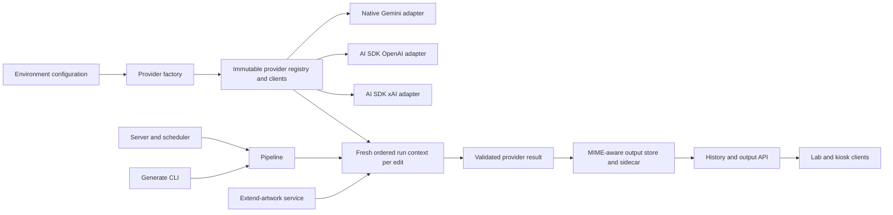
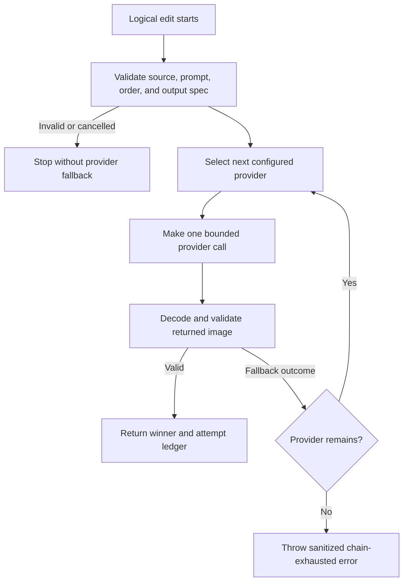
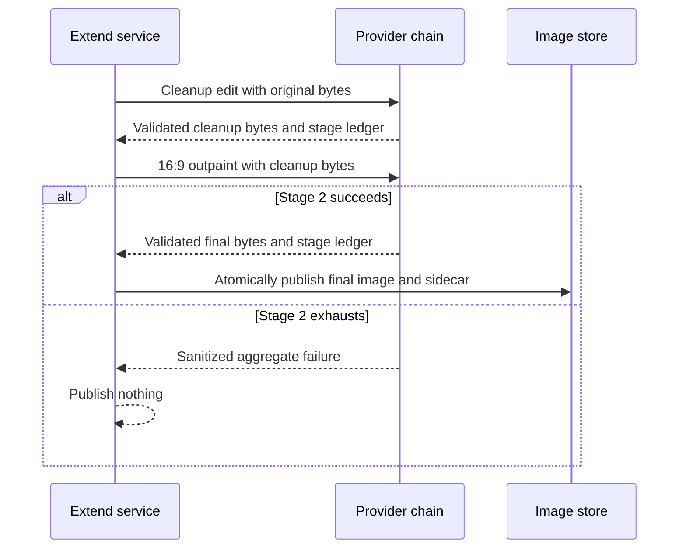

# Configurable Image Provider Fallback - Plan

## Goal Capsule

Promote the successful image-model experiment into Haystack's production generation flow. Normal renders and both extend-artwork stages use a configurable direct-provider chain whose default order is Gemini, OpenAI, then xAI. Gemini keeps the quality improvements proven in the paid comparison: high thinking and ultra-high media resolution on every source-image part.

The Product Contract owns user-visible behavior. The Planning Contract owns implementation choices. Implementation Units may refine local mechanics but must not change either contract.

Execution is a Standard code change across the engine, configuration, storage, server, scheduler, Lab UI metadata, and extend-artwork skill. Automated tests and builds run before any paid provider call. Live image calls require an operator checkpoint because they consume provider balances.

Stop and ask for direction only if a provider cannot support the confirmed output contract, an external API contradicts the pinned official documentation, or implementation would require Vercel AI Gateway, Black Forest Labs, aesthetic auto-scoring, or another scope expansion.

---

## Product Contract

### Summary

Haystack will try direct image providers in a configurable order and publish the first structurally valid result. The default order is Gemini, OpenAI, then xAI. Gemini remains the primary provider and uses high thinking plus ultra-high source-image media resolution in normal generation and extend-artwork.

### Problem Frame

The current production pipeline is coupled to Gemini. A Gemini refusal, no-image response, timeout, or provider error ends the render even though the comparison work proved that OpenAI and xAI can edit the same source. The current persistence path also assumes every output is PNG, while actual Gemini and xAI results can be JPEG.

The application needs provider flexibility without delegating routing or billing to a gateway. It also needs truthful output metadata and deterministic recovery behavior across scheduled renders and the two-stage extend-artwork flow.

### Key Decisions

- **Use direct provider keys and omit Vercel AI Gateway.** The application owns routing while each provider authenticates and bills through the user's existing account. Governs R1, R2, R15. *(session-settled: user-approved — chosen over Vercel AI Gateway: direct keys preserve the tested provider paths and avoid an unnecessary routing and billing layer.)*
- **Default to Gemini, OpenAI, then xAI, with configuration controlling future order changes.** Governs R1, R3, R7. *(session-settled: user-directed — chosen over a fixed single provider or hard-coded order: Gemini won the comparison, but the preferred order may change.)*
- **Apply the proven Gemini detail settings to production normal and extend-artwork edits.** Governs R4, R5, R14. *(session-settled: user-directed — chosen over retaining the old Gemini defaults: high thinking and ultra-high input processing materially improved people and faces.)*
- **Treat a structurally valid image as success regardless of aesthetics.** Governs R6, R7. *(session-settled: user-approved — chosen over automatic quality-based retries: visual preference remains a human judgment and must not create unpredictable cost.)*
- **Retry the full provider chain from the day's selected artwork on every scheduled run.** Only after every configured provider fails for the current artwork does that run advance to the next artwork in sequence; the next hourly run starts again from the day's selected artwork. Governs R10-R11. *(session-settled: user-directed — chosen over quarantining an artwork, rotating only on a special refusal code, or limiting the run to one alternate: the fallback providers exist specifically to transform artworks Gemini rejects.)*
- **Keep Black Forest Labs outside the production chain.** Governs R1 and the Scope Boundaries. *(session-settled: user-directed — chosen over adding a fourth provider now: existing OpenAI and xAI keys and balances are sufficient for the first production chain.)*

### Requirements

#### Provider selection and configuration

- R1. `HAYSTACK_IMAGE_PROVIDER_ORDER` accepts a comma-separated, unique subset of `gemini`, `openai`, and `xai`. When explicitly set, every named provider must have its direct API key at startup. When unset, Haystack derives the available subset in preferred order `gemini,openai,xai` from the keys present and requires at least one provider.
- R2. Production provider calls use `GOOGLE_API_KEY` or `GEMINI_API_KEY`, `OPENAI_API_KEY`, and `XAI_API_KEY` directly; no AI Gateway credential, route, or fallback participates.
- R3. A logical edit snapshots the configured order, source bytes, prompt, and output specification, then tries providers sequentially and stops after the first valid image.

#### Image quality and provider behavior

- R4. Every production Gemini edit sets high thinking and attaches ultra-high media resolution to each source-image part; the completed bake-off keeps its fixed experimental profiles.
- R5. Normal generation uses the tested provider profiles. Extend-artwork cleanup preserves the source aspect ratio with each provider's closest supported 2K profile; only outpainting requests each provider's closest supported 16:9 2K profile.
- R6. Every returned image must have supported PNG, JPEG, or WebP bytes, decode successfully, report positive dimensions, and satisfy the stage's aspect-ratio contract before it can end fallback.

#### Failure and recovery

- R7. Refusal or policy blocks, no-image responses, invalid images, a provider-specific unsupported output specification, provider timeouts, rate limits, authentication or quota failures, and provider transport or server failures advance to the next configured provider; aesthetic weakness never does.
- R8. Caller cancellation, expiration of the total-chain deadline, and local failures that another provider cannot repair stop the logical edit without further provider calls; local failures include unreadable source data, invalid configuration, invalid prompt construction, storage failure, and a globally invalid output specification.
- R9. A fully exhausted chain raises one typed, sanitized failure that preserves ordered attempt outcomes without exposing raw provider bodies, credentials, authorization headers, or base64 image data.

#### Scheduled generation

- R10. Every scheduled generation starts with the artwork selected for that day and exhausts the configured provider chain for that original before considering another artwork.
- R11. When the full provider chain exhausts with fallback-eligible provider outcomes, the same scheduled invocation advances to the next artwork in sequence and restarts at provider one. It continues until an artwork succeeds or every available artwork has exhausted the chain. The next hourly invocation discards the prior run's attempted-artwork state and starts again with the artwork selected for that day; caller cancellation and non-provider local failures stop without advancing artwork.

#### Persistence and delivery

- R12. A successful render records the winning provider, requested model, optional resolved model, detected MIME type, dimensions, configured order, and a JSON-safe sanitized attempt ledger alongside the existing Render metadata.
- R13. New images use the file extension and response `Content-Type` that match detected bytes; history, purge, download, and output delivery continue to work for legacy `.png` records, including legacy files whose bytes are JPEG.

#### Extend-artwork

- R14. Cleanup and 16:9 outpainting each run a fresh provider chain; stage 2 consumes only the validated bytes produced by stage 1 and restarts from the first configured provider.
- R15. Extend-artwork publishes one final image and one truthful sidecar only after stage 2 succeeds; stage-1 success followed by stage-2 exhaustion leaves the source and image directory unchanged.

#### Compatibility and operations

- R16. Shut-down Gemini preview IDs fail configuration with their stable replacement named; the defaults become `gemini-3.1-flash-lite-image` for normal generation and `gemini-3.1-flash-image` for extend-artwork.
- R17. Provider SDK retries are disabled, attempt deadlines are bounded, and the launchd backup timeout exceeds the maximum normal provider-chain duration with margin.
- R18. The fixed image-model bake-off retains its original model profiles, artifacts, and tests after shared adapter and validation code is extracted.
- R19. Every logical edit emits exactly one sanitized terminal event for success, exhaustion, caller cancellation, total-chain deadline, or a local post-start failure. It contains the chain ID, stage, configured order, safe attempt categories and durations, winner or terminal outcome, and render ID when one exists.
- R20. Image-generation, extend-artwork, and scheduler-trigger mutations accept only loopback socket peers and, when a browser supplies `Origin`, an allowlisted local Lab origin. Server, scheduler, CLI, and extend entry points share one application-wide paid-generation lock; LAN clients may use read-only kiosk and image-delivery routes, and a rejected or competing mutation makes no provider call.
- R21. LAN-facing API responses use an allowlisted presentation DTO containing only display fields and the winning provider/model. Full attempt ledgers, request IDs, usage or cost details, source paths, and operator diagnostics remain in restricted local sidecars and logs.

### Key Flows

- F1. **Normal render.** Read the original once, compose the prompt once, run the ordered chain, validate each result, save the first valid image and sidecar, then expose it through history and output APIs. Covers R3, R6-R9, R12-R13.
- F2. **Scheduled recovery.** Start with the artwork selected for that day, run F1, and after full provider-chain exhaustion select the next artwork and restart F1 from the first provider. Continue through the available artwork sequence until one succeeds or all exhaust. A later hourly run starts over from that day's selected artwork. Covers R10-R11.
- F3. **Extend artwork.** Run cleanup through a new chain, pass the winning validated buffer to a second new chain for 16:9 outpainting, then publish the final artifact through the sidecar-last commit protocol. Covers R14-R15.
- F4. **Configuration startup.** Parse models, order, and keys before constructing network clients; fail with a safe actionable message before any image call when configuration is invalid. Covers R1-R2, R16.

### Acceptance Examples

- AE1. With the default order and a successful Gemini response, Haystack makes one Gemini call, makes no OpenAI or xAI call, and saves Gemini as the winner. Covers R3-R4, R7, R12.
- AE2. When Gemini refuses a recognized painting and OpenAI returns a valid image, Haystack saves the OpenAI result and records both attempts in order. Covers R3, R7, R9, R12.
- AE3. When Gemini and OpenAI fail and xAI returns a valid image, Haystack saves xAI with its actual JPEG or PNG MIME and extension. Covers R7, R12-R13.
- AE4. When Gemini returns an aesthetically weak but valid image, Haystack accepts it and does not call a fallback provider. Covers R6-R7.
- AE5. When all configured providers fail or refuse the day's selected artwork, scheduled generation saves nothing for that artwork, advances to the next artwork, and restarts at provider one. Covers R9-R11.
- AE6. If an alternate artwork succeeds, the invocation saves only that result. At the next scheduled hour, Haystack again starts with the artwork selected for that day and retries the complete provider order regardless of the previous hour's outcome. Covers R10-R11.
- AE7. When extend cleanup succeeds with OpenAI and outpainting succeeds with Gemini, the final sidecar reports the two distinct stage winners and stage 2 receives exactly OpenAI's validated bytes. Covers R14-R15.
- AE8. When extend cleanup succeeds but every outpainting provider fails, no cleanup intermediate or final image appears in the image directory. Covers R14-R15.
- AE9. A legacy record named `.png` whose bytes are JPEG remains listable, viewable, downloadable, and purgeable with an accurate served MIME type. Covers R13.
- AE10. A configured order of `xai,gemini` requires only xAI and Google keys, calls xAI first, and never constructs or calls OpenAI. Covers R1-R3.
- AE11. A fully exhausted edit writes no sidecar but still produces one sanitized terminal event that can be correlated by chain ID. Covers R9, R19.
- AE12. A LAN kiosk can read the latest image, while the same non-loopback client cannot start a generation or extend operation; rejection happens before a provider call. Covers R20.
- AE13. While one scheduled, manual, or extend generation owns the paid-generation lock, another mutation returns a safe busy response without calling a provider; public responses omit the attempt ledger and operator-only fields. Covers R20-R21.

### Success Criteria

- A provider outage or refusal can fall through without changing the original-artwork rule or duplicating a successful render.
- Normal and extend Gemini requests demonstrably contain high thinking and per-part ultra-high media resolution.
- New Render metadata tells the operator which provider and model produced the visible image and why earlier providers failed, using only allowlisted safe fields.
- PNG, JPEG, and WebP outputs survive save, history, API delivery, download, and retention cleanup.
- Provider order can change through configuration without code changes.
- Every terminal outcome can be correlated through exactly one sanitized terminal event per logical chain.
- Mocked verification completes without network access; paid smoke tests occur only at the explicit operator checkpoint.

### Scope Boundaries

In scope:

- Direct Gemini, OpenAI, and xAI provider adapters and ordered fallback.
- Gemini detail settings in normal generation and both extend-artwork stages.
- Provider-aware metadata, MIME-correct storage and delivery, scheduler recovery, configuration migration, and extend-artwork documentation.
- Reuse of the direct-provider work already proven by the comparison tool.

Out of scope:

- Vercel AI Gateway, Black Forest Labs, automatic cost routing, provider load balancing, and cross-provider SDK retries.
- A Lab UI provider picker, rankings, aesthetic scoring, or automatic retry of an ugly but valid image.
- Silent cropping, stretching, upscaling, or format conversion to make a provider result fit.
- Re-running or redesigning the completed comparison matrix.

---

## Planning Contract

### Key Technical Decisions

- KTD1. Build an application-owned sequential provider chain over direct credentials. The chain, not an SDK gateway, owns ordering, short-circuiting, and safe aggregate failure. Governs R1-R3, R7-R9. *(session-settled: user-approved — chosen over Vercel AI Gateway routing: direct provider accounts are already funded and the application needs transparent, changeable order.)*
- KTD2. Keep Gemini on native `@google/genai` and use AI SDK 6 direct provider adapters for OpenAI and xAI. This preserves Gemini's exact thinking and per-part media controls while reusing the edit shape already proven by the comparison tool. Governs R2, R4-R5, R18. *(session-settled: user-approved — chosen over forcing all providers through one abstraction: Gemini's proven input-detail control is native-provider-specific.)*
- KTD3. Give every provider one application call per attempt. Set Gemini HTTP retry attempts to one total call and AI SDK `maxRetries` to zero. Record provider-deadline, total-chain-deadline, and caller-cancellation provenance separately so only a provider deadline advances fallback. Governs R3, R7-R8, R17.
- KTD4. Translate a provider-neutral output specification inside each adapter. Normal Gemini uses Flash Lite at 1K, high thinking, and ultra-high input detail; normal OpenAI uses `gpt-image-2`, low output quality, and an explicit source-ratio size near 2K; normal xAI uses `grok-imagine-image-2.0`, low quality, and 1K. Extend cleanup preserves the source ratio at each provider's closest supported 2K profile. Extend outpainting uses stable Gemini Flash Image at 2K and 16:9 and OpenAI `2048x1152`; xAI participates only when the validated cleanup input is already within the 16:9 tolerance because its single-image edit cannot change aspect ratio. An ineligible xAI outpaint returns `unsupported_output_spec` locally without a billable call. Governs R4-R6, R14, R16. *(session-settled: user-directed — chosen over the former Gemini defaults and uniformly higher-cost outputs: these are the profiles accepted after the visual and price comparison.)*
- KTD5. Represent provider outcomes with a common typed taxonomy and preserve a more specific safe provider code when available. The chain owns provider fallback, while the scheduler reacts only to full chain exhaustion and never parses provider messages or reinterprets individual ledger entries. Governs R7-R11, R19.
- KTD6. Make detected image bytes authoritative. Use a server-only decoder such as `sharp` to validate full decode, dimensions, byte limits, and aspect ratio without changing the provider output; retain strict signature checks before decode. Governs R6, R12-R13.
- KTD7. Construct one immutable server-side provider registry with reusable SDK clients, then create a fresh run context for every logical edit. Each run owns its order snapshot, deadlines, cancellation provenance, source, prompt, output specification, and attempt ledger; extend creates two run contexts over the same registry. Keys load from the gitignored `.env.local` or injected process environment at startup, remain server-side in provider construction and adapter closures, are never serialized or logged, and are rotated by replacing the value and restarting the server and launchd jobs. Governs R1-R3, R12, R14-R15.
- KTD8. Treat the sidecar rename as the filesystem commit point. Write and validate both temporary files, promote the image first, and promote the sidecar last; listing considers only valid sidecars committed and cleanup handles orphan temporary or image files. New resolution trusts only validated sidecar ID and MIME or an allowlisted basename, while legacy `outputPath` remains informational. Governs R12-R13, R15.
- KTD9. Give each normal provider attempt a 180-second deadline, the per-artwork provider chain a maximum 570-second budget, and the launchd backup client a 660-second wait. Remove transport-level curl retries, allow a multi-artwork scheduler invocation to continue after a client disconnect, and rely on the shared generation lock, scheduler mutex, and logical-hour deduplication to prevent a second chain. Governs R17, R19-R20.
- KTD10. Implement extend-artwork as testable two-stage orchestration over the shared provider registry. Each stage creates a separate run context and attempt ledger; the validated stage-2 result is committed with the sidecar-last protocol in KTD8. Governs R14-R15.
- KTD11. Keep shared contracts, validation, normalization, and adapter mechanisms under `src/engine`; keep production profiles and comparison catalogs separate. `src/comparison` may import engine adapters, but engine code never imports comparison modules. Governs R4-R6, R18.
- KTD12. Split the LAN surface by capability: read-only kiosk, history, and image-delivery routes may bind to the configured LAN host, while every paid or state-changing route verifies the socket peer is loopback and any supplied browser origin is an allowlisted local Lab origin before parsing work. Use one atomic application-wide lock shared by server, scheduler, CLI, and extend processes, with owner metadata and tested crash-stale recovery. Serialize public responses through an explicit allowlist; keep detailed attempt data local. Governs R20-R21.

### High-Level Technical Design

The diagrams show ownership and sequencing. They are not class or method specifications.







### Provider and Output Contract

| Concern | Gemini | OpenAI | xAI |
|---|---|---|---|
| Direct client | `@google/genai` | `@ai-sdk/openai` through AI SDK 6 | `@ai-sdk/xai` through AI SDK 6 |
| Normal model/profile | `gemini-3.1-flash-lite-image`, 1K, high thinking | `gpt-image-2`, low quality, explicit source-ratio size near 2K | `grok-imagine-image-2.0`, 1K, low quality |
| Extend cleanup profile | `gemini-3.1-flash-image`, 2K, source ratio, high thinking | `gpt-image-2`, low quality, explicit source-ratio size near 2K | `grok-imagine-image-2.0`, 2K, closest supported source ratio, low quality |
| Extend outpaint profile | `gemini-3.1-flash-image`, 2K, 16:9, high thinking | `gpt-image-2`, low quality, `2048x1152` | Eligible only when input is already 16:9; otherwise skip locally without a provider call |
| Source processing | Per-image-part ultra-high media resolution | High fidelity is intrinsic; omit unsupported `inputFidelity` | Provider edit endpoint through the xAI adapter |
| Retry posture | One total HTTP attempt | `maxRetries: 0` | `maxRetries: 0` |

Normal generation derives an explicit output specification from the decoded source. Gemini may omit aspect ratio to preserve the source. OpenAI derives compliant dimensions whose edges are multiples of 16. xAI receives an explicit supported ratio; an unsupported ratio becomes a safe provider capability outcome without a billable call. Extend stage 2 requires 16:9 within a small rounding tolerance, so xAI is eligible only when stage 1 already produced 16:9 input. No adapter crops or stretches the result.

### Failure and Metadata Model

The shared attempt taxonomy contains `successful`, `refusal`, `no_image`, `invalid_image`, `unsupported_output_spec`, `provider_timeout`, `chain_deadline`, `rate_limited`, `authentication`, `quota`, `provider_error`, and `caller_cancelled`. Provider-specific codes remain optional safe fields and do not replace the common category. Provider fallback advances on the categories in R7; caller cancellation, chain deadline, and local failures in R8 stop immediately. Scheduler artwork advancement depends only on full chain exhaustion, not on a provider-specific refusal label.

Each attempt records a generated attempt ID, stage, ordinal, provider, requested model, ISO start and completion times, duration, outcome, abort provenance, safe code, optional request ID, and allowlisted usage or cost data. A successful result also records MIME, dimensions, byte count, and SHA-256. Gemini may add `resolvedModel`; OpenAI and xAI must not pretend the configured model is a provider-resolved snapshot.

Raw provider messages, response bodies, headers outside a small allowlist, prompts duplicated inside provider metadata, credentials, and image payloads are excluded. The existing top-level prompt remains part of Render metadata.

### System-Wide Impact

- **Engine boundary:** `Pipeline` stops constructing `GeminiClient` and receives a provider-neutral editor through dependency injection. The original artwork is still the only source for normal generation.
- **Configuration boundary:** startup derives the preferred available subset when the order is unset, or validates every explicitly selected provider and key before serving or scheduling. Comparison-only key loading becomes a shared secret loader without placing secrets in `PipelineConfig`.
- **Persistence boundary:** the image extension can no longer be inferred from the render ID. `OutputStore` becomes the single resolver for metadata-to-image lookup, legacy fallback, serving, and purge.
- **Failure propagation:** scheduler and HTTP handlers consume typed chain failures. They do not inspect human-readable provider messages.
- **Latency and cost:** fallback is sequential and may create up to three billable attempts. The first valid result stops the chain. No SDK retry or aesthetic retry multiplies cost.
- **Concurrency:** each request snapshots immutable provider order and owns its attempt ledger. One application-wide atomic lock serializes all paid scheduled, manual, CLI, and extend operations across processes; a competing mutation fails before any provider call.
- **Client compatibility and exposure:** Lab and kiosk URLs stay ID-based, LAN clients retain read-only presentation access, and new optional metadata fields do not invalidate older sidecars. Public DTOs omit operator-only attempt details even though restricted local sidecars retain them.
- **Dependency direction:** production engine modules own provider mechanisms. Comparison modules depend on them through fixed experiment wrappers; the production engine never imports comparison catalogs or pricing.

### Risks and Dependencies

- **Provider API drift:** current Gemini 3 guidance and the pinned SDK support the per-part ultra-high setting on v1beta, while an older media-resolution page still describes v1alpha. Pin the compatible SDK line, assert the serialized request shape, and stop at the live Gemini checkpoint if v1beta rejects the setting rather than silently lowering detail.
- **Retired models:** the configured extend preview IDs are already shut down. Migrate defaults and return replacement-specific errors before live verification.
- **Output corruption or mismatch:** AI SDK can return bytes without proving they decode. Use independent decode and geometry validation before declaring success.
- **Credential readiness:** GPT Image models may require OpenAI Organization Verification. Google standard keys require migration to Gemini authorization keys before September 2026. Document both as operational prerequisites.
- **Long fallback latency:** three 180-second attempts plus orchestration overhead exceed the current launchd request deadline. Apply KTD9 and verify the installed launchd configuration is refreshed without curl transfer retries.
- **LAN-triggered spend:** the server intentionally binds to the LAN for the kiosk. Enforce KTD12 before reading mutation bodies or acquiring provider resources, and test with socket-derived addresses rather than trusting forwarding headers.
- **Legacy MIME mismatch:** some old `.png` files may contain JPEG. Sniff bytes at resolution time and keep all file lookups constrained to the output directory and supported extensions.
- **Native validation dependency:** a decoder such as `sharp` adds a native package. Verify installation and build on the supported macOS Node 20 environment before relying on it.

### Phased Delivery and Human Checkpoints

| Phase | Units | Outcome | Human checkpoint |
|---|---|---|---|
| A — Core provider chain | U1-U2 | Provider-neutral adapters, validation, configuration, and deterministic fallback are complete under mocks. | Review the exact default models, order, and provider settings. No paid calls occur. |
| B — Production render path | U3-U4 | MIME-aware persistence and the normal Pipeline path work end to end. | Snapshot the existing output directory, then approve one paid normal render and inspect the image, sidecar, and terminal event before scheduler rollout. |
| C — Recovery and extend | U5-U6 | Scheduler recovery and both extend stages use the chain. | Approve one paid extend run; verify the local final artifact and sidecar, then API delivery and kiosk display separately. |

### Sources and Research

Repository anchors:

- `src/engine/pipeline.ts` — current Gemini-coupled generation and Render metadata construction.
- `src/engine/gemini-client.ts` — native Gemini boundary and typed no-image/timeout errors.
- `src/comparison/providers.ts` and `src/comparison/image-validation.ts` — proven direct OpenAI/xAI adapters, safe normalization, and signature validation.
- `src/config/config.ts` — environment parsing and the current comparison-only key boundary.
- `src/storage/output-store.ts`, `src/server/server.ts`, and `lab-ui/src/components/PreviewPanel.tsx` — current PNG assumptions.
- `src/server/scheduler.ts` — current mutex, deduplication, and message-based `IMAGE_OTHER` artwork recovery.
- `scripts/extend-artwork.ts` — current Gemini-only two-stage extend flow.
- `CONCEPTS.md` — Render and kiosk delivery semantics.
- `docs/solutions/integration-issues/raspberry-pi-kiosk-hardcoded-mac-ip.md` — layer-by-layer generation, API, and kiosk verification guidance.

External authorities:

- [Gemini deprecations](https://ai.google.dev/gemini-api/docs/deprecations) — stable replacements and shutdown dates.
- [Gemini image generation](https://ai.google.dev/gemini-api/docs/generate-content/image-generation) and [Gemini 3 generation controls](https://ai.google.dev/gemini-api/docs/generate-content/gemini-3) — thinking, image parts, output sizes, and response handling.
- [AI SDK image generation](https://ai-sdk.dev/docs/ai-sdk-core/image-generation) — direct `generateImage`, edit inputs, output metadata, and retry behavior.
- [OpenAI image generation](https://developers.openai.com/api/docs/guides/image-generation) — GPT Image 2 editing, size constraints, fidelity behavior, pricing inputs, and organization verification.
- [xAI image editing](https://docs.x.ai/developers/model-capabilities/images/editing) and [image configuration](https://docs.x.ai/developers/model-capabilities/images/generation) — Grok Imagine 2.0 edit route, resolutions, quality, and ratios.

---

## Implementation Units

### U1. Provider-neutral contracts, validation, and direct adapters

**Goal:** Create one production-ready edit contract and reuse the direct-provider work without importing comparison-only profiles into production.

**Requirements:** R3-R9, R18. **Decisions:** KTD2-KTD6, KTD11.

**Files:**

- `package.json`
- `package-lock.json`
- `src/engine/provider-types.ts` (new)
- `src/engine/image-validation.ts` (new)
- `src/engine/gemini-client.ts`
- `src/engine/openai-client.ts` (new)
- `src/engine/xai-client.ts` (new)
- `src/comparison/providers.ts`
- `src/comparison/types.ts`
- `src/comparison/image-validation.ts`
- `tests/engine/gemini-client.test.ts`
- `tests/engine/image-validation.test.ts` (new)
- `tests/engine/provider-adapters.test.ts` (new)
- `tests/comparison/providers.test.ts`

**Approach:**

- Define provider-neutral edit input, output specification, validated success, attempt outcome, and safe provider error contracts.
- Generalize the comparison adapters into reusable direct clients with injected model profiles and deadlines. Keep `createRound1Providers()` as a thin wrapper over its fixed comparison catalog.
- Enforce the dependency direction in KTD11 so production profiles cannot import comparison model, pricing, or artifact concerns.
- Parameterize Gemini request construction for thinking and per-image-part media resolution. Production profiles use v1beta, high thinking, ultra-high input detail, one total HTTP attempt, and final non-thought image extraction; comparison wrappers retain their fixed experimental profiles.
- Add full decode and geometry validation for PNG, JPEG, and WebP. Return detected MIME and dimensions without transcoding the image.
- Normalize provider errors through typed properties and allowlists. Do not use message substring matching outside the adapter boundary.

**Test Scenarios:**

- Gemini normal and 16:9 2K requests both include high thinking and ultra-high resolution on every image part.
- Gemini ignores interim thought-image parts and extracts the final non-thought image.
- OpenAI uses `gpt-image-2`, an explicit compliant size, low quality, no `inputFidelity`, `n: 1`, and `maxRetries: 0`.
- xAI uses exact model `grok-imagine-image-2.0`, the requested supported ratio and resolution, low quality, `n: 1`, and `maxRetries: 0`.
- xAI outpainting returns `unsupported_output_spec` without a network call when the validated input is not already 16:9; already-16:9 input uses the exact 2K profile.
- Empty, truncated, mislabeled, undecodable, oversized, zero-dimension, and wrong-ratio buffers fail validation; valid PNG, JPEG, and WebP pass with truthful metadata.
- Refusal, no-image, timeout, 429, auth, quota, 5xx, transport, and invalid-image responses map to safe outcomes with no raw response or key leakage.
- Existing comparison tests prove its fixed Round 1 call shapes and artifact semantics did not change.

**Verification:** Focused provider, Gemini, validation, and comparison suites pass without network access. TypeScript build accepts the new shared contracts and native decoder dependency.

### U2. Ordered fallback chain, production configuration, and factory

**Goal:** Make provider order configurable and construct one direct-provider chain for every production entry point.

**Requirements:** R1-R3, R7-R9, R16-R17, R19. **Decisions:** KTD1, KTD3-KTD5, KTD7, KTD9.

**Dependencies:** U1.

**Files:**

- `.env.example`
- `AGENTS.md`
- `src/config/config.ts`
- `src/engine/provider-chain.ts` (new)
- `src/engine/provider-factory.ts` (new)
- `src/engine/index.ts`
- `src/engine/types.ts`
- `tests/config/config.test.ts`
- `tests/engine/provider-chain.test.ts` (new)
- `tests/engine/provider-factory.test.ts` (new)

**Approach:**

- Parse and validate the provider order as an immutable list. When the variable is absent, derive the preferred available subset from present keys; when it is explicit, require every selected key and reject startup before client construction when one is absent.
- Migrate model defaults to stable Gemini IDs. Reject the shut-down preview IDs with replacement-specific guidance and warn for the October 2026 Gemini 2.5 retirement if custom configuration still selects it.
- Construct only selected adapters in an immutable registry and keep credentials outside `PipelineConfig` and serializable metadata.
- Document that real keys live only in the gitignored `.env.local` or injected environment, recommend owner-only file permissions, prohibit printing them in setup checks, and require server and launchd restart after rotation.
- Create fresh run state for each edit over the shared registry. Run one provider at a time, short-circuit on validated success, and throw a sanitized typed aggregate after exhaustion.
- Enforce per-attempt and total-chain deadlines while allowing an external cancellation signal to stop the chain.

**Test Scenarios:**

- With all three keys and no explicit order, the default is Gemini, OpenAI, then xAI; with fewer keys and no explicit order, only available providers are selected in that preference order.
- Explicit subset and reordered configurations produce the exact requested list, and an explicit order with a missing key fails before client construction.
- Empty, unknown, duplicate, or whitespace-only order values fail with actionable errors.
- An omitted or unavailable provider requires no key and is never constructed; zero available providers fails startup with a safe actionable message.
- Gemini success makes one call; Gemini failure then OpenAI success makes two; two failures then xAI success makes three.
- Every provider receives identical source bytes, prompt, and logical output specification for a stage.
- Every fallback outcome advances; a valid but aesthetically weak result short-circuits; cancellation and global local failures stop immediately.
- Aggregate exhaustion preserves ordered safe attempts and cannot serialize injected keys, authorization headers, base64 data, or raw provider messages.
- Two concurrent invocations against the same registry and chain service have independent signals, attempt ledgers, immutable order snapshots, and unique IDs.
- A provider deadline advances to the next provider; caller cancellation and total-chain deadline stop before another provider starts.

**Verification:** Focused configuration, factory, and chain suites pass with spies proving call count, order, short-circuiting, and redaction.

### U3. MIME-aware Render metadata, storage, and delivery

**Goal:** Persist and serve the actual provider output format without breaking existing renders.

**Requirements:** R6, R12-R13, R21. **Decisions:** KTD6, KTD8, KTD12.

**Dependencies:** U1.

**Files:**

- `src/engine/types.ts`
- `src/storage/output-store.ts`
- `src/server/server.ts`
- `lab-ui/src/types.ts`
- `lab-ui/src/components/PreviewPanel.tsx`
- `tests/storage/output-store.test.ts`
- `tests/server/server.test.ts`

**Approach:**

- Extend Render metadata with optional backward-compatible provider, resolved-model, MIME, geometry, byte-count, hash, configured-order, and attempt-ledger fields.
- Save new images under the allowlisted extension that matches detected bytes. Use the sidecar-last commit protocol from KTD8 and treat orphan images or temporary files as uncommitted.
- Centralize ID-to-image resolution in `OutputStore`. For legacy metadata, inspect supported sibling files and sniff bytes instead of trusting `.png`.
- Purge the resolved image associated with each removed sidecar across supported extensions, without following arbitrary metadata paths outside the output directory.
- Serve the sniffed MIME and update the Lab download extension and detail display from metadata. Serialize LAN-facing history/latest/detail responses through an allowlisted presentation DTO; never pass storage sidecars through wholesale.

**Test Scenarios:**

- PNG, JPEG, and WebP save under the correct extension and return the correct path, MIME, and download filename.
- History and latest-render responses include new optional fields and continue to parse legacy sidecars.
- Public history, latest, and detail DTOs expose safe presentation fields plus the winning provider/model, but omit attempt ledgers, provider request IDs, usage/cost details, source paths, and raw diagnostics.
- A legacy `.png` containing JPEG bytes is served as `image/jpeg`, downloads safely, and is purged with its sidecar.
- Missing, ambiguous, path-traversal, unsupported-extension, and corrupt legacy outputs fail safely.
- Mixed-format retention deletes the correct oldest image-sidecar pair and leaves newer files intact.
- A simulated failure between image and sidecar promotion leaves no listed render, and the next maintenance pass safely removes the orphan without touching committed files.

**Verification:** Storage and server suites pass, the Lab TypeScript build succeeds, and no output endpoint trusts a client-supplied path or unvalidated MIME.

### U4. Production Pipeline and entry-point integration

**Goal:** Route normal manual and scheduled renders through the ordered chain and persist the actual winner.

**Requirements:** R3-R9, R12-R13, R16-R17, R19-R21. **Flows:** F1, F4. **Decisions:** KTD1, KTD5, KTD7-KTD9, KTD12.

**Dependencies:** U2, U3.

**Files:**

- `src/engine/pipeline.ts`
- `src/engine/types.ts`
- `src/engine/generation-lock.ts` (new)
- `src/server/start.ts`
- `src/cli/generate.ts`
- `examples/basic-edit.ts`
- `src/server/server.ts`
- `tests/engine/pipeline.test.ts`
- `tests/server/server.test.ts`

**Approach:**

- Inject the provider-neutral chain into `Pipeline`; use one shared factory in server, CLI, and example entry points.
- Read the original image into validated immutable bytes once and compose one prompt before the provider chain starts.
- Persist only the winning validated result. Record its provider and requested model in top-level Render metadata and attach the full safe attempt ledger.
- Keep prompt, scenario, seed where applicable, response text, and Gemini-only observability fields backward compatible.
- Map typed aggregate failures to generic API responses. Return 429 only when every failed attempt is rate-limited; otherwise return the existing generic generation failure surface.
- Reject non-loopback paid mutations and untrusted browser origins before parsing generation work. Acquire the atomic application-wide paid-generation lock in server, scheduler, CLI, and extend entry points; a competing operation returns a safe busy result before any provider call. Persist only non-secret owner metadata and reclaim a crash-stale lock through a bounded, race-tested path.
- Emit exactly one sanitized terminal event for success, exhaustion, caller cancellation, total-chain deadline, or local post-start failure so paths without sidecars remain observable.

**Test Scenarios:**

- Gemini success, OpenAI fallback success, and xAI fallback success each persist one truthful output and sidecar.
- All-provider exhaustion persists no image or sidecar and returns one safe failure.
- Every terminal outcome emits exactly one terminal event with chain ID, safe attempt categories, and an optional render ID.
- A storage failure after provider success does not call the next provider.
- Prompt override and composed-prompt paths send one identical prompt to every attempt.
- Existing original-artwork, scenario serialization, Render ID, history, and latest-output behavior remains intact.
- A LAN client can read presentation routes but cannot start generation; a second concurrent paid operation in the same or a separate process receives a safe busy response. Both rejections occur before any provider call, and a verified crash-stale lock can be reclaimed without allowing two owners.

**Verification:** Pipeline and server integration suites pass with injected mock chains, then the full root test suite and build pass before Checkpoint B permits a live call.

### U5. Scheduler recovery and launchd deadline alignment

**Goal:** Try the complete provider chain for each artwork in sequence while restarting every hourly run from that day's selected artwork.

**Requirements:** R9-R11, R17, R19-R20. **Flow:** F2. **Decisions:** KTD5, KTD9, KTD12.

**Dependencies:** U4.

**Files:**

- `src/server/scheduler.ts`
- `launchd/com.haystack.hourly.plist`
- `scripts/launchd-install.sh`
- `tests/server/scheduler.test.ts`
- `AGENTS.md` launchd operational documentation

**Approach:**

- Replace `IMAGE_OTHER` message parsing with typed chain-exhaustion inspection; no provider-specific refusal code controls artwork movement.
- At the beginning of every scheduled invocation, select the artwork for that day and create a fresh invocation-local attempted-artwork set. Exhaust the full provider order for that artwork before selecting the next artwork in sequence and restarting at provider one. Continue until one artwork succeeds or every available artwork exhausts.
- Never persist a rejection, quarantine, or alternate-artwork cursor across hours. Preserve the scheduler mutex, active-hour rules, manual trigger behavior, and logical-hour deduplication so the next hourly run again starts with the day's selected artwork.
- Remove curl transfer retries, raise the backup client wait to 660 seconds, and make installation guidance require reinstalling the plist after this change. Server work may finish after curl disconnects; terminal events and latest output determine completion.

**Test Scenarios:**

- Primary Gemini failure followed by OpenAI success does not rotate artwork.
- Any full provider-chain exhaustion for the current artwork advances to the next artwork and restarts at Gemini by default, including refusal-only, technical-only, and mixed provider outcomes.
- The invocation continues through the ordered artwork collection until one succeeds or every artwork has received the complete provider chain exactly once.
- Caller cancellation, total-chain deadline, storage failure, and invalid local configuration stop without advancing artwork because the provider chain did not complete normally.
- Two consecutive hourly invocations both begin with that day's selected artwork even when the first invocation succeeded only on an alternate or exhausted every artwork.
- Concurrent in-process and backup triggers still share the mutex and do not start duplicate chains for the same logical hour.
- The installed launchd command contains no curl retry flag; a simulated 660-second client disconnect does not cancel server work or create a second billable chain when the trigger repeats.
- Manual trigger after scheduler resume generates immediately, while API delivery and kiosk presentation remain separate verification layers.

**Verification:** Scheduler suites pass with structured failures, and the launchd plist has a timeout greater than the normal chain budget.

### U6. Provider fallback for both extend-artwork stages

**Goal:** Apply the same configurable chain and Gemini quality settings to cleanup and 16:9 outpainting.

**Requirements:** R1-R9, R13-R17, R19-R20. **Flow:** F3. **Decisions:** KTD2-KTD8, KTD10-KTD12.

**Dependencies:** U2, U3.

**Files:**

- `src/engine/extend-artwork.ts` (new)
- `scripts/extend-artwork.ts`
- `.agents/skills/extend-artwork/SKILL.md`
- `.claude/skills/extend-artwork/SKILL.md`
- `tests/engine/extend-artwork.test.ts` (new)
- `tests/config/config.test.ts`

**Approach:**

- Move the two-stage operation into a testable service and leave the script as argument parsing, configuration, progress, and result output.
- Give cleanup and outpainting separate chain invocations and attempt ledgers. Pass only validated cleanup bytes and detected MIME into stage 2.
- Use the explicit 16:9 2K output profile in KTD4 for stage 2 and validate the final ratio before publication.
- Write the final image and companion metadata under a MIME-correct `-landscape` name only after both stages succeed. Emit each stage winner, requested model, attempts, final MIME, and output path as safe JSON.
- Update both skill copies so usage, results, errors, and retry guidance are provider-neutral and no longer promise PNG or Gemini-only failures.

**Test Scenarios:**

- Each stage restarts from the first configured provider and can have a different winner.
- Stage-1 fallback bytes become the exact stage-2 input; the original source is never reused for outpainting after cleanup succeeds.
- Stage-1 exhaustion prevents stage 2; stage-2 exhaustion publishes no intermediate or final file.
- Gemini requests in both stages contain high thinking and per-part ultra-high media resolution.
- OpenAI produces an explicit `2048x1152` request and Gemini receives 16:9 2K settings. xAI receives a 2K outpaint call only for already-16:9 input; other inputs skip xAI locally and preserve call-order accounting.
- Cleanup and outpainting each emit exactly one sanitized terminal event for every terminal outcome.
- JPEG, PNG, and WebP final outputs receive truthful filenames and sidecars; an existing `-landscape` suffix is not duplicated.
- CLI output and both skill documents contain no Gemini-only, PNG-only, key-leaking, or raw-provider-error assumptions.

**Verification:** Extend service and CLI-focused tests pass without network calls, both skill copies agree, and the root and Lab builds remain green.

---

## Verification Contract

### Automated Gates

Run focused tests after each unit, then run the complete gates before any paid smoke test:

```bash
npm run test:run
npm run build
npm --prefix lab-ui run build
git diff --check
```

The complete test suite must prove:

- Exact provider request profiles and disabled retries.
- Order, short-circuiting, fallback taxonomy, cancellation, deadlines, and redaction.
- Full image decode, dimensions, aspect ratio, MIME detection, and mixed-format persistence.
- Pipeline metadata, allowlisted public API delivery, loopback mutation enforcement, the global generation lock, scheduler artwork sequencing, and two-stage extend semantics.
- Comparison-tool behavior remains unchanged.

No automated test may use real provider credentials or make an external image call.

### Operator Checkpoints

1. **Credential go/no-go:** Confirm Gemini uses a current authorization key and stable model ID, OpenAI has GPT Image 2 organization access, and xAI has Grok Imagine 2.0 access plus sufficient balance. Include only verified providers in the deployed order and record non-secret evidence without printing key values.
2. **Legacy baseline:** Pause scheduled generation and create a recoverable snapshot plus a filename, size, and SHA-256 inventory of the output directory. Every pre-existing sidecar must resolve to exactly one supported sibling image; ambiguity, corruption, or an outside-directory path is a no-go.
3. **Paid normal smoke:** Configure Gemini alone and, after explicit approval, generate one known weather scenario. Verify the local image decodes, the sidecar names Gemini and the stable model, the terminal event names the same render, and the output API serves the detected MIME.
4. **Paid challenger smoke:** Before enabling a challenger, configure it alone for one known edit. Recent bake-off evidence may replace this call only when it used the same account, current key, exact model, and shared adapter path. Restore the default order after both challengers qualify.
5. **Paid extend smoke:** Configure Gemini alone and, after explicit approval, run one cleanup-plus-outpaint operation. Verify both stage ledgers, exact 16:9 geometry, MIME-correct filename, and the absence of an intermediate file.
6. **Delivery verification:** Check a fresh local output and sidecar first, then `/api/latest` and `/api/outputs/:id`, then the Lab and kiosk. Confirm retained legacy-file hashes are unchanged. A stale kiosk alone does not prove provider generation failed.
7. **Scheduler rollout:** Reinstall and reload the launchd configuration, inspect the installed plist for no curl retries and a 660-second client wait, trigger one manual scheduled generation, and confirm exactly one terminal event per attempted artwork chain and at most one render for the logical hour.
8. **Observation:** Do not manufacture a provider failure in production. Treat the first natural fallback win as live transition confirmation, and after one to two weeks inspect the recorded winner counts without imposing a formal rescue-rate target.

Live refusal and provider-outage branches are verified with mocks rather than by sending deliberately failing paid requests. Fresh paid verification is capped at six successful image calls: one Gemini normal call, two Gemini extend-stage calls, one OpenAI call, one xAI call, and one scheduler rollout call. A waiver names the unverified provider and leaves it disabled unless the operator explicitly accepts its first fallback as live verification.

### First-Day Monitoring and Stop Conditions

- Disable an affected provider through configuration after any authentication or quota outcome.
- Pause rollout after any latest-output 404, MIME or extension mismatch, duplicate render for one logical hour, malformed sidecar, legacy hash mutation, or sensitive provider data in logs or metadata.
- Treat fallback success as a provider-health and cost signal, not as a failed render.
- Record the winning provider and full exhaustion safely, but do not quarantine an artwork, carry an alternate-artwork cursor into the next hour, or automatically disable a provider based on fallback frequency.
- Diagnose a stale kiosk only after checking the local artifact and API delivery layers.

### Rollback

Use a soft rollback first: set `HAYSTACK_IMAGE_PROVIDER_ORDER=gemini`, restart the server and launchd jobs, and confirm every retained history item still resolves with a matching served MIME. For a storage incident, pause generation, preserve the output directory and logs, and fix forward. Do not revert to the old `.png` resolver while new `.jpg` or `.webp` renders exist. A full code rollback is allowed only after mixed-format post-deploy artifacts are recoverably quarantined or the pre-deploy snapshot is restored. Never reintroduce retired Gemini preview IDs.

---

## Definition of Done

### Global Completion Contract

- All requirements R1-R21 and acceptance examples AE1-AE13 are covered by automated or operator verification.
- Default production behavior is direct Gemini, then OpenAI, then xAI, with no Vercel Gateway or Black Forest Labs path.
- Gemini normal and extend requests contain the proven high-thinking and ultra-high input-detail settings.
- The first valid image wins, fallback outcomes are typed, and aesthetic quality never triggers another billable call.
- New and legacy PNG, JPEG, and WebP renders work through save, history, latest, output serving, download, and purge.
- Scheduler and extend flows follow their documented provider and artwork boundaries.
- Secrets and raw provider responses do not appear in logs, metadata, API responses, snapshots, or test fixtures.
- Every logical edit emits one sanitized terminal event, including full exhaustion when no sidecar exists.
- Full root tests, root build, Lab build, and whitespace checks pass.
- Operator-approved paid smoke checks remain within the six-call ceiling, or each waiver names the unverified provider and its disabled or explicitly accepted status.
- The legacy output snapshot and inventory remain available until local, API, Lab, kiosk, and retention checks pass.
- Abandoned experiments, duplicate comparison-only implementations, temporary files, and dead compatibility code are removed from the final diff.

### Unit Completion Contract

- U1 is done when shared contracts, adapters, and decoder-backed validation are tested and comparison behavior is unchanged.
- U2 is done when order and key validation, stable model migration, factory construction, and sequential aggregate fallback are deterministic under mocks.
- U3 is done when MIME-aware new outputs and legacy mismatched outputs pass storage, server, history, download, and purge tests.
- U4 is done when every production generation entry point injects the chain and persists one truthful winner or nothing on exhaustion.
- U5 is done when every scheduled hour starts with that day's selected artwork, every artwork receives the complete provider chain before advancement, invocation-local alternates do not persist across hours, curl does not retry, and launchd timing exceeds the chain budget.
- U6 is done when both extend stages independently use the chain, final publication uses the sidecar-last commit protocol, and both skill copies describe the production behavior.
