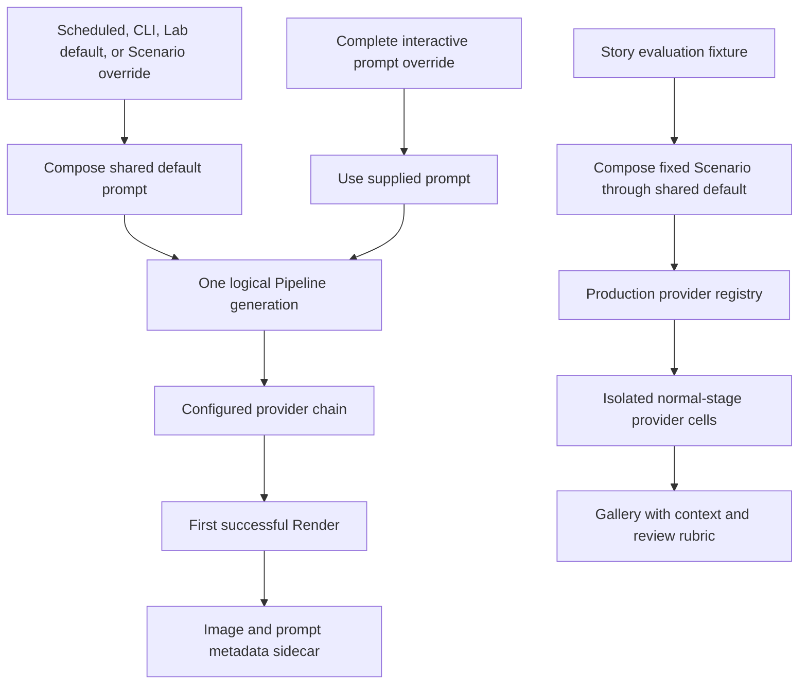

# Story-Rich Hourly Renders - Plan

## Goal Capsule

- **Objective:** Every Haystack Render created with the default prompt depicts a self-contained, scene-specific moment that makes the viewer pause and wonder what is happening while remaining coherent with the source artwork and current Scenario.
- **Means:** Express the outcome once in the shared default prompt, protect its entry-point boundaries with regression tests, and validate it with a repeatable qualitative image fixture. (KTD1, KTD5)
- **Product authority:** The viewer's double-take response defines narrative success; the source artwork and current Scenario determine what kind of situation fits.
- **Execution profile:** Code change with paid external-provider verification after deterministic tests pass.
- **Stop conditions:** Stop before shipping if a default path misses the narrative contract or the product owner rejects the complete review batch; do not broaden scope or enter repeated paid reruns without a new decision.
- **Tail ownership:** The implementer owns deterministic verification and fixture generation; the product owner supplies final visual acceptance.

---

## Product Contract

### Summary

Haystack will apply one story-rich narrative contract through its shared default prompt while preserving its current single-Render pipeline, provider fallback behavior, and explicit full-prompt escape hatch.
The change includes contract tests across default and override paths plus a separate, repeatable human-review fixture spanning contrasting artworks and Scenarios.

### Product Contract Preservation

The requirements-only Product Contract is preserved without narrowing or expansion.
R11 and AE5 are clarified meaning-preservingly so that “prompt override” refers only to a complete user-supplied prompt; the existing Kiosk Scenario override remains a default-prompt path.

### Problem Frame

The current prompt already asks for a coherent, time-and-weather-specific micro-story and visibly different living activity.
In practice, most Renders still fall back to passive scenes such as a couple walking, a family spending time together, or someone with a pet.
Time, daylight, and weather changes read well, but the repeated activity makes the artwork predictable over time.

The missing standard is narrative curiosity.
A successful Render should contain enough visible evidence of an unfolding situation that the viewer instinctively asks what is happening.

### Key Decisions

- **Let the model choose the dramatic range.** (session-settled: user-directed — chosen over a quiet-versus-dramatic quota: the artwork and circumstances should determine the fitting intensity.) Governs R2 and R6.
- **Make every Render self-contained.** (session-settled: user-directed — chosen over a connected daily story: viewers may miss several hourly generations.) Governs R1 and R9.
- **Keep generations independent of recent history.** (session-settled: user-directed — chosen over supplying recent story summaries: the first version should remain completely independent.) Governs R9.
- **Constrain narrative quality, not narrative content.** (session-settled: user-directed — chosen over a fixed catalyst palette: hardcoded motifs could become a new source of repetition.) Governs R1 through R5.
- **Start with one outcome-only generation pass.** (session-settled: user-approved — chosen over a separate story director or multi-Render tournament: it preserves spontaneity with less cost and complexity.) Governs R1, R9, and R10.
- **Use provider policy as the tone boundary.** (session-settled: user-directed — chosen over additional product-level content restrictions: no expected corporate image-model output was identified as unsuitable for the living room.) Governs R1 and R2.

### Actors

- A1. The viewer encounters the latest Render as living-room art and judges whether its situation creates curiosity.
- A2. Haystack supplies the original artwork, current Scenario, preservation rules, and narrative outcome to the configured image provider.
- A3. The image provider interprets those inputs and creates the story situation without exposing or requiring a written plot.

### Requirements

**Narrative outcome**

- R1. Each default generation must depict one coherent, self-contained situation that prompts the viewer to wonder what is happening and implies a larger story without explaining it.
- R2. The image provider must choose a plausible dramatic intensity from the specific artwork and current Scenario without a fixed ratio of quiet to dramatic scenes.
- R3. The generation behavior must avoid the most predictable stock interpretation when a more interesting scene-specific situation fits the same inputs.
- R4. The Render must communicate its situation through visible action, reaction, relationships, consequences, or other evidence that implies what came before or may happen next.
- R5. A passive social or leisure activity is insufficient on its own; it must contain a readable circumstance that creates narrative curiosity.

**Scenario and artwork fit**

- R6. Time and weather must influence the story situation when they create a meaningful circumstance rather than serving only as lighting, clothing, or surface treatment.
- R7. Ordinary conditions must still permit an intriguing situation without forcing extreme drama or inventing weather significance that the artwork does not support.
- R8. Narrative changes must preserve the permanent setting, visual style, camera, framing, and other established artwork constraints.

**Independence and coverage**

- R9. Each generation must use the original base artwork and current Scenario without consulting a previous Render or recent story summary.
- R10. The same narrative outcome must apply wherever Haystack uses its default generation prompt, across configured image providers and both scheduled and interactive generation paths.
- R11. A complete user-supplied prompt override remains authoritative and is not required to satisfy the default narrative outcome; a Scenario-only override still uses the default prompt.

### Key Flow

- F1. Create one story-rich Render
  - **Trigger:** A scheduled or interactive generation uses Haystack's default prompt.
  - **Actors:** A2, A3
  - **Steps:** Haystack supplies the original artwork and current Scenario; the provider avoids the obvious stock reading, chooses a fitting self-contained situation, and renders visible narrative evidence under the artwork-preservation rules.
  - **Outcome:** A1 sees a coherent Render that invites interpretation without needing context from another hour.
  - **Covers:** R1 through R10.

### Acceptance Examples

- AE1. Weather creates the circumstance
  - **Covers:** R2, R4, R6, and R8.
  - **Given:** The source artwork can plausibly support human activity and the Scenario contains meaningful snowfall.
  - **When:** Haystack creates a default Render.
  - **Then:** The provider may depict a situation caused or complicated by the snow, with visible participants responding to it, while preserving the artwork's setting and style.

- AE2. Ordinary conditions still produce curiosity
  - **Covers:** R1, R3, R5, and R7.
  - **Given:** The Scenario contains mild, ordinary conditions with no obvious crisis.
  - **When:** Haystack creates a default Render.
  - **Then:** The scene still contains a plausible, non-obvious situation with readable narrative evidence rather than defaulting to unqualified companionship or leisure.

- AE3. Drama is not forced
  - **Covers:** R2 and R7.
  - **Given:** A subtle situation fits the source artwork better than a major incident.
  - **When:** The provider chooses the story situation.
  - **Then:** The Render may remain quiet as long as it still implies a larger story and provokes curiosity.

- AE4. Generations remain independent
  - **Covers:** R9.
  - **Given:** Several Renders have already been created from the same base artwork that day.
  - **When:** The next scheduled generation begins.
  - **Then:** Its story situation is derived only from the original artwork and current Scenario, not from the content of earlier Renders.

- AE5. Full prompt overrides remain intentional
  - **Covers:** R10 and R11.
  - **Given:** A user supplies a complete prompt override through interactive generation.
  - **When:** Haystack creates the Render.
  - **Then:** Haystack honors the override even when it does not contain the default narrative contract.

- AE6. Scenario-only overrides retain the story contract
  - **Covers:** R10 and R11.
  - **Given:** A user supplies a short Scenario description through the Kiosk override.
  - **When:** Haystack creates the Render.
  - **Then:** Haystack places that description inside the shared default prompt rather than treating it as a complete prompt override.

### Success Criteria

- A representative review batch consistently causes the viewer to pause and ask some version of “What is going on here?”
- A Render fails the narrative bar when its full observable situation is only passive companionship or leisure with no implied circumstance, consequence, or unanswered question.
- Reviewers can recognize that time and weather affected the situation when those conditions are narratively meaningful.
- Story changes do not weaken the existing preservation of the source artwork's permanent setting, style, and composition.

### Scope Boundaries

#### Deferred to Follow-Up Work

- Provider-specific prompt wording, only if the shared contract shows a repeatable provider-specific weakness.
- A separate story-director model pass.
- Recent-Render summaries or connected stories across a day.
- Multiple candidate Renders followed by automatic selection.
- Restore a runnable ESLint 9 configuration; the repository currently declares a lint command but has no ESLint configuration, and that unrelated tooling repair is not part of this feature.

#### Excluded from This Design

- Quotas for dramatic intensity or story-type distribution.
- A fixed catalogue, taxonomy, or rotation of narrative motifs.
- Additional tone or subject restrictions beyond provider policy.
- A direct creativity or temperature control that the image-edit API does not expose.
- Changes to first-success publication, provider fallback, alternate-artwork recovery, or the original-base-artwork rule.

### Dependencies and Assumptions

- Scenario weather fields are optional; when they are unavailable, the artwork and available time or daylight context remain sufficient inputs for a self-contained situation.
- Narrative quality is subjective but reviewable through the agreed double-take test without a numeric story-diversity quota.
- A provider-valid but narratively dull image may still be published; this version improves the prompt and evaluates its tendency rather than adding runtime quality selection.
- The configured image providers and credentials must be available for the paid review fixture, but deterministic verification must not require network access.

### Sources and Research

- `src/engine/prompt.ts` — current micro-story, activity-change, weather, and artwork-preservation instructions.
- `src/engine/pipeline.ts`, `src/engine/provider-chain.ts`, and `src/server/scheduler.ts` — prompt composition, first-success provider fallback, alternate-artwork recovery, and original-artwork handling.
- `src/server/server.ts`, `lab-ui/src/App.tsx`, and `src/cli/generate.ts` — default generation, full prompt override, Scenario-only override, and CLI entry points.
- `src/comparison/bake-off.ts` and `src/comparison/gallery.ts` — existing resumable artifact and gallery patterns; the fixed Round 1 matrix is not the story-evaluation baseline.
- [OpenAI Image Prompting Guide](https://developers.openai.com/api/docs/guides/image-prompting) — supports concrete visible actions, labeled edit sections, and separating requested changes from invariants.
- [OpenAI Image Generation Guide](https://developers.openai.com/api/docs/guides/image-generation) — documents image controls and limitations; the direct edit path exposes no temperature setting.
- [AI SDK `generateImage` reference](https://ai-sdk.dev/docs/reference/ai-sdk-core/generate-image) — confirms the installed single-image edit request shape remains suitable.

---

## Planning Contract

### Key Technical Decisions

- KTD1. **Keep the shared default template as the only production policy boundary.** Update `DEFAULT_TEMPLATE` rather than adding provider branches, story state, or pipeline suffixes, so every default path inherits the same contract. (session-settled: user-directed — chosen over a fixed catalyst system: hardcoded story inputs would replace one repetitive pattern with another.) Governs R1 through R10.
- KTD2. **Use a situation-first labeled edit specification.** Order the default prompt as outcome, current conditions, narrative change, preservation invariants, then lighting and weather details; require concrete visible evidence while leaving the situation itself open-ended. Governs R1 through R8.
- KTD3. **Preserve the two override boundaries.** A complete interactive prompt bypasses `DEFAULT_TEMPLATE`, while the Kiosk Scenario override is composed inside it; tests will name both cases explicitly. Governs R10 and R11.
- KTD4. **Treat one pass as one logical Render, not one transport attempt.** Do not add aesthetic retries, planning calls, or candidate selection; retain existing provider and alternate-artwork recovery with the same composed prompt. (session-settled: user-approved — chosen over a story director or multi-Render tournament: the first version should remain simple and spontaneous.) Governs R1, R9, and R10.
- KTD5. **Add an evaluation path around the production adapters.** A story-specific runner loads the normal Haystack configuration and invokes each configured provider directly, preserving production model and output settings without allowing fallback to hide individual results. (session-settled: user-approved — chosen over ad hoc Lab runs or automated aesthetic scoring: the baseline should be repeatable without pretending narrative taste is deterministic.) Governs R1 through R8 and R10.
- KTD6. **Keep provider transports and model settings unchanged.** Retain the current provider order, `n: 1`, medium OpenAI quality, timeout behavior, and no automatic retry or temperature option; official documentation does not justify an adapter change for this feature. Governs R9 and R10.

### High-Level Technical Design

The existing prompt boundary remains the center of production behavior; the new evaluation path observes that boundary without entering scheduled generation.

The mode contract prevents similarly named overrides and recovery attempts from drifting into different story behavior.

| Mode | Prompt source | Narrative contract | Generation semantics |
|---|---|---|---|
| Scheduled, backup trigger, CLI, or Lab default | `DEFAULT_TEMPLATE` plus current Scenario | Required | Existing first-success chain |
| Kiosk Scenario override | `DEFAULT_TEMPLATE` plus supplied Scenario text | Required | Existing scheduler recovery |
| Complete Lab prompt override | User-supplied template or prompt | Not injected | Existing first-success chain |
| Story-evaluation cell | `DEFAULT_TEMPLATE` plus fixed Scenario | Required | One direct normal-stage output per configured production adapter and cell |

### Evaluation Matrix and Review Contract

The repeatable baseline uses `artwork/hopper.jpg` as a people-capable scene and `artwork/cabin-in-the-woods.png` as a sparse scene.
Each artwork is paired with three fixed, serialized Scenarios: ordinary clear daytime, mild twilight conditions, and significant weather at night.
The matrix runs once per configured provider, making six outputs for one provider and eighteen when all three providers are configured.

Every successful output is reviewed against five independent questions:

1. Does the image trigger an immediate “What is going on here?” response?
2. Is there visible evidence of an action, reaction, consequence, or implied before-and-after?
3. Does the situation fit the artwork and use Scenario conditions meaningfully without forcing drama?
4. Are the permanent setting, style, camera, framing, and composition preserved?
5. Is this the most predictable reading of the artwork and Scenario, or a more specific situation the same inputs support?

An output fails the narrative gate if it contains only passive companionship or leisure with no readable circumstance.
The evaluator creates a companion review checklist that records the five answers and notes per output; the batch-level stock-interpretation judgment is based on those recorded answers.
The review does not score dramatic intensity, motif frequency, or diversity quotas.

### Implementation Constraints

- Keep `composePrompt` deterministic for a given template and Scenario so fallback attempts receive identical wording.
- Keep the Scenario placeholder and existing solar-lighting precedence intact.
- Do not make a previous Render, generated image, or recent metadata prompt an input to story selection.
- Treat `metadata.prompt` as the audit record for the effective request, including Kiosk Scenario overrides; do not redesign sidecar or Kiosk response schemas in this work.
- Keep the historical Round 1 provider bake-off and its fixed matrix unchanged.
- Do not import `ComparisonProvider`, `ROUND1_MODELS`, or `ROUND1_PROVIDER_SPECS` into the story evaluator; those types and settings belong to the historical bake-off.
- Retain the story evaluator as supported prompt-development tooling, separate from production generation and from temporary experiments.
- Create each evaluation in a new timestamped directory with exclusive creation; do not add run-resume or replay semantics.

### Sequencing

1. Establish the new prompt contract and its deterministic unit coverage.
2. Lock entry-point, override, fallback, and metadata behavior around that contract.
3. Add the isolated evaluation fixture, then run paid visual validation only after local gates pass.

### Risks and Mitigations

| Risk | Impact | Mitigation |
|---|---|---|
| The new language remains too abstract | Providers continue producing generic leisure scenes | Require observable situational evidence and reject passive activity as a complete scene |
| Narrative direction overwhelms preservation | Renders drift from the source artwork | Keep mutable narrative changes separate from explicit invariants and retain preservation-order tests |
| The fixture overfits a small set of stories | The prompt appears better only on rehearsed motifs | Fix artwork and weather coverage, not story content; keep all narrative choices open to the model |
| Provider behavior differs | One provider meets the bar while another regresses | Run the same fixed cells per configured provider and defer specialized wording until evidence supports it |
| Paid evaluation is interrupted | A partial gallery cannot support acceptance | Preserve its terminal cells for diagnosis, mark it not ready for review, and start a fresh run only after the operational failure is resolved |

### System-Wide Impact

- **Generation surfaces:** KTD1 changes the content received by scheduled generation, the launchd backup trigger, CLI generation, Lab defaults, and Kiosk Scenario overrides; `/api/config/default-template` returns new content with the same response schema.
- **Override and metadata contracts:** KTD3 leaves complete Lab prompts authoritative, keeps API and Kiosk response shapes stable, and makes no change to `RenderMetadata`.
- **Production operations:** KTD4 and KTD6 leave request counts, provider fallback, the generation lock, output storage, purge behavior, and first-success publication unchanged.
- **Evaluation operations:** KTD5 is opt-in local tooling under a timestamped directory in `~/.haystack/story-evaluations/`, does not acquire the production generation lock, and makes `6 × configured-provider-count` paid calls for a fresh run.
- **Operational isolation:** Avoid running the fixture alongside scheduled generation when shared provider quotas or rate limits could interfere; evaluation artifacts have independent manual retention.
- **Sensitive data:** Evaluation manifests retain only local audit context and allowlisted provider outcomes, never credentials or raw provider errors.

---

## Implementation Units

### U1. Replace the micro-story hint with the narrative outcome contract

- **Goal:** Make the default prompt ask for a coherent, scene-specific situation with visible narrative evidence while preserving the artwork and Scenario.
- **Requirements:** R1 through R8; AE1, AE2, and AE3; KTD1 and KTD2.
- **Dependencies:** None.
- **Files:** `src/engine/prompt.ts`, `tests/engine/prompt.test.ts`.
- **Approach:**
  1. Restructure `DEFAULT_TEMPLATE` into clearly labeled edit sections without changing the `{scenario}` substitution contract.
  2. Replace the current character-first “living activity” bias with situation-first wording that allows actors only when the artwork supports them.
  3. Express R1 through R7 through concrete visible outcomes rather than story categories, examples that act as a hidden taxonomy, or numeric distribution rules.
  4. Preserve the existing permanent-setting, style, camera, framing, scale, and solar-lighting rules under R8.
- **Patterns to follow:** The ordered positive-result instructions in `src/engine/prompt.ts` and `src/engine/scenario.ts`; the phrase-and-order assertions in `tests/engine/prompt.test.ts`.
- **Test scenarios:**
  - Covers AE1. A Scenario with heavy snow composes a prompt that asks weather to shape the situation when meaningful and keeps preservation rules present.
  - Covers AE2. An ordinary clear Scenario composes a prompt that still requires readable narrative evidence without requiring a crisis.
  - Covers AE3. The template permits subtle intrigue and contains no quiet-versus-dramatic ratio.
  - A time-only Scenario with unavailable weather still produces a complete narrative contract and does not invent a weather requirement.
  - The scenario description appears before lighting and weather application, while the solar-lighting precedence remains unchanged.
  - The template requires self-containment, avoids passive activity as the whole scene, and contains no fixed motif taxonomy.
- **Verification:** Contract tests prove the required narrative, Scenario, and preservation clauses appear in the intended order for weather-rich and time-only inputs.

### U2. Lock default, override, fallback, and metadata boundaries

- **Goal:** Prove that every existing default path receives the shared contract while complete user prompts and recovery behavior retain their current authority.
- **Requirements:** R9 through R11; AE4, AE5, and AE6; KTD3, KTD4, and KTD6.
- **Dependencies:** U1.
- **Files:** `tests/engine/pipeline.test.ts`, `tests/engine/provider-chain.test.ts`, `tests/server/scheduler.test.ts`, `tests/server/server.test.ts`.
- **Approach:**
  1. Extend characterization coverage at existing seams instead of changing production orchestration.
  2. Assert composition at the seams that branch: Pipeline defaults, Lab default forwarding, scheduled and backup-trigger forwarding, CLI-equivalent time-only composition, and Kiosk Scenario overrides.
  3. Assert that a non-empty complete prompt override remains unchanged apart from its documented Scenario placeholder substitution.
  4. Reuse existing provider-chain and scheduler fallback tests to prove the exact composed prompt is stable across provider and alternate-artwork attempts.
  5. Preserve sidecar assertions showing that the effective prompt is saved without exposing it through the Kiosk response.
- **Execution note:** Add characterization assertions before changing any adjacent production behavior; this unit should remain test-only unless an existing path violates the clarified contract.
- **Patterns to follow:** Existing prompt capture in Pipeline tests, existing same-source-and-prompt coverage in `tests/engine/provider-chain.test.ts`, scheduler override tests, and the default-template server endpoint test.
- **Test scenarios:**
  - Covers AE4. Existing metadata from earlier Renders may participate in current-hour deduplication but never enters prompt composition.
  - Covers AE5. A complete interactive prompt without the story clauses reaches the provider without injected default wording.
  - Covers AE6. A Kiosk Scenario override is surrounded by the story-rich default contract and saved as the effective metadata prompt.
  - A whitespace-only Lab prompt override follows the default path.
  - A first-provider success performs no additional generation request.
  - A fallback provider receives the exact source and prompt used by the failed primary attempt.
  - Scheduler alternate-artwork recovery reuses the original Scenario and an equivalent deterministic prompt without using the failed generated output.
  - The default-template endpoint returns the same narrative contract edited in U1.
- **Verification:** The entry-point tests distinguish complete-prompt and Scenario-only overrides, and all recovery tests preserve one logical Render with no aesthetic retry.

### U3. Add a repeatable story-prompt evaluation fixture

- **Goal:** Retain a lightweight prompt-development tool that produces auditable, side-by-side evidence for the double-take outcome across representative conditions and configured providers.
- **Requirements:** R1 through R8 and R10; AE1, AE2, and AE3; KTD5 and KTD6.
- **Dependencies:** U1 and U2.
- **Files:** `src/evaluation/story-evaluation.ts`, `scripts/story-prompt-evaluation.ts`, `tests/evaluation/story-evaluation.test.ts`, `package.json`.
- **Approach:**
  1. Define the six fixed artwork-and-Scenario cells from the Evaluation Matrix and compose each prompt through the production `DEFAULT_TEMPLATE`.
  2. Load production configuration through the existing config converters, construct the production provider registry, validate each source, and invoke each configured adapter directly with the effective normal-stage output specification: configured aspect ratio when present, otherwise source ratio.
  3. Default to a zero-request preview that lists matrix cells, resolved providers, and paid-call count; require `--execute` before issuing provider requests.
  4. Create one fresh timestamped output directory exclusively, then persist a manifest, images, effective prompts, serialized Scenarios, source digests, provider/model identities, output specification, allowlisted terminal outcomes, and a per-cell review checklist.
  5. Render a simple gallery that shows each original artwork, a human-readable Scenario summary, every expected provider cell and status, and the five-question qualitative rubric without calculating an aesthetic score.
  6. Mark partial, missing, or unsuccessful matrices as not ready for product review instead of adding resume, replay, or compatibility-fingerprint machinery.
- **Execution note:** Run this paid fixture only after deterministic tests and the type build pass. If the product owner rejects the batch, stop with the gallery evidence and request direction rather than entering an unbounded rerun loop or promoting deferred mechanisms.
- **Patterns to follow:** Atomic artifact writes, MIME verification, and safe relative image paths in `src/comparison/`; production registry construction and image validation in `src/engine/`.
- **Test scenarios:**
  - The matrix contains exactly two contrasting artworks crossed with ordinary daytime, mild twilight, and significant-weather nighttime Scenarios.
  - A preview without `--execute` lists the complete matrix and makes zero provider requests.
  - Each configured provider receives exactly one independent request per matrix cell with the same effective prompt for that cell and the effective production output specification.
  - A fixture manifest records prompt, serialized Scenario, artwork, provider/model, and terminal outcome without API keys or raw provider errors.
  - An existing timestamped output path fails before any provider request.
  - Unsupported or mismatched image bytes become a safe unsuccessful outcome shown as a labeled placeholder rather than as an image.
  - The gallery shows the original source, readable time/daylight/weather context, every expected cell, and successful, unsuccessful, and pending counts.
  - Partial, unsuccessful, and empty matrices display a prominent not-ready state; only a complete successful matrix is ready for product review.
  - The companion checklist contains one row per expected output with fields for all five review questions and reviewer notes.
  - Gallery escaping and relative-path validation prevent stored labels or paths from injecting markup or escaping the output directory.
  - The story evaluator uses configured production models and settings and never imports fixed Round 1 provider specifications.
  - The generated gallery shows the qualitative rubric and no dramatic-intensity or motif-distribution score.
- **Verification:** Fixture tests prove preview safety, matrix completeness, provider isolation, production-setting parity, persistence, and gallery safety; one fresh paid run supplies the visual acceptance evidence.

---

## Verification Contract

| Gate | Command or review | Proves | Required for |
|---|---|---|---|
| Focused contract tests | `npm run test:run -- tests/engine/prompt.test.ts tests/engine/pipeline.test.ts tests/engine/provider-chain.test.ts tests/server/scheduler.test.ts tests/server/server.test.ts tests/evaluation/story-evaluation.test.ts` | Prompt wording, entry-point boundaries, recovery reuse, metadata audit, fixture behavior | U1, U2, U3 |
| Full regression suite | `npm run test:run` | Existing engine, server, storage, and comparison behavior remains intact | Global |
| Type build | `npm run build` | Strict TypeScript and NodeNext imports compile | Global |
| Story fixture | `npm run evaluate:stories -- --execute` | Each configured provider produces the fixed qualitative review matrix without hidden fallback | U3 |
| Product review | Inspect the generated gallery and complete its per-output review checklist | Double-take curiosity, visible evidence, Scenario fit, source-artwork preservation, and non-obvious interpretation | Product acceptance |

The paid fixture begins only after every deterministic gate passes.
`npm run lint` is not a gate for this work because the repository has no ESLint configuration; restoring that pre-existing command is explicitly deferred above.
Provider transport failures are operational failures to resolve or rerun, not narrative passes or failures.
The visual baseline passes when the matrix is complete, the checklist records every narrative miss, and the product owner accepts the batch's overall double-take quality without seeing a systematic return to stock interpretations.
An individual narrative miss informs that judgment but is not an automatic ship blocker in a one-pass stochastic system.

---

## Definition of Done

- U1 is complete when the shared default prompt expresses R1 through R8 with concrete visible outcomes, preserves existing Scenario and artwork constraints, and passes its contract tests.
- U2 is complete when all default paths, override boundaries, fallback behavior, and prompt metadata are covered without changing first-success publication semantics.
- U3 is complete when the retained evaluation tool is deterministic in matrix construction, safe in fresh-run execution, and produces an inspectable gallery for every configured provider.
- The focused suite, full suite, and build all pass.
- A complete paid fixture run has been reviewed by the product owner and meets the Verification Contract's visual baseline.
- No prompt history, story taxonomy, dramatic quota, temperature option, director pass, candidate tournament, provider-specific branch, or unrelated refactor appears in the final diff.
- Historical Round 1 comparison behavior and artifacts remain compatible.
- Abandoned prompt variants, one-off evaluation scripts outside U3, and dead-end experimental code are removed before handoff; the supported U3 evaluator remains.
